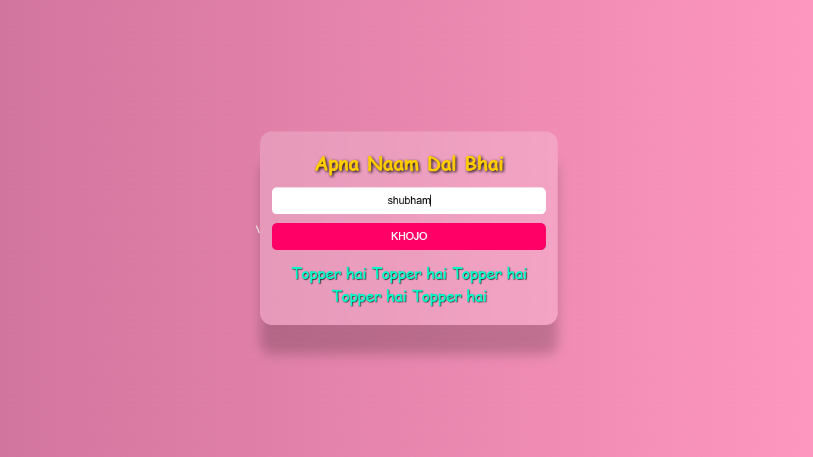

# 🤡 Roast Web App 🔥

Welcome to **Roast-Web** — a funny little web app that gives hilarious and personalized roasts based on your name! 😎  
Type your name, press the button, and prepare to get roasted. (All in good fun, of course!)  

> ⚠️ Warning: May cause uncontrollable laughter and friend-group chaos.

---

## 🖼️ Preview

 <!-- Add your own screenshot URL here -->

---

## 🚀 Features

- 🎯 Roasts based on specific names
- 🔊 Speech synthesis in Hindi (your roast gets spoken aloud!)
- 😂 Meme audio when no match is found
- 🎨 Funny and colorful UI
- 📱 Fully responsive for mobile and tablet
- 🧠 Logic handled via pure JavaScript

---

## 🔧 How To Use

1. Clone or download the repository
2. Open `index.html` in your browser
3. Type your name and click `Khojo`
4. Enjoy the roast... or cry in a corner. 😂

---

## 🧠 Tech Stack

- HTML5
- CSS3 (Custom fun styling + responsive design)
- JavaScript (DOM + SpeechSynthesis API)
- Humor 🤪

---

## 📦 Coming Soon

- 💾 LocalStorage support to save your roast history
- 📋 Add your own custom roast lines
- 👥 Random roast mode (even without name input)

---

## 💌 Contribution

Want to add more names and roasts?  
PRs are welcome — just keep the tone light-hearted and fun!

---

## 🙌 Credits

- UI and Roast Logic: [Your Name]
- Background Image: Freepik / Unsplash (or whichever image you use)
- Audio Meme Clip: [Mention source if applicable]
- Inspired by: Roast culture & late-night coding humor 🌙

---

## 🐸 Fun Note

This project is just for laughs. No hard feelings!  
If you got roasted, that means you’re already special 💅

---

